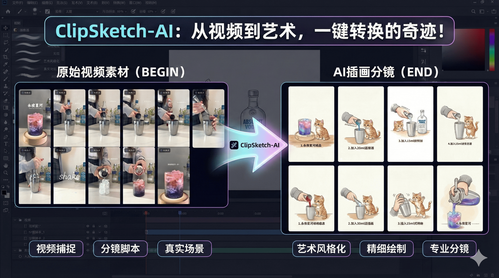
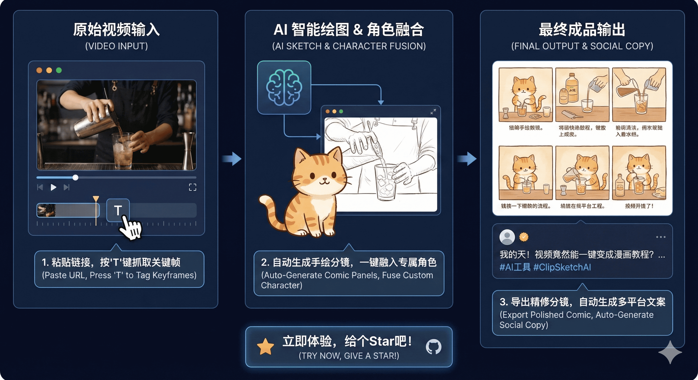

# ClipSketch AI

<div align="center">



**Turn Video Moments into Hand-Drawn Stories**

[](https://react.dev/)
[](https://www.typescriptlang.org/)
[](https://tailwindcss.com/)
[](https://ai.google.dev/)

[English](README.en.md) | [中文](README.md) | [日本語](README.ja.md) | [한국어](README.ko.md)

[Features] • [Quick Start] • [User Guide] • [Tech Stack]

</div>

## 📖 Introduction

**ClipSketch AI** is a full-process productivity tool designed for video creators, social media managers, and fan-art enthusiasts.

More than just a video player, it is an **AI-powered content creation workbench**. It can parse video links from Bilibili and Xiaohongshu (RedNote), allowing you to tag key moments with frame-level precision. Integrating Google Gemini's latest multimodal models, it transforms these moments into exquisite hand-drawn storyboards with one click and automatically generates viral copy adapted for social media.

## 🖥️ Interface Preview

<div align="center">
  
</div>

## ✨ Key Features



### 🎥 Powerful Video Capture
*   **Multi-Source Import**: Supports parsing sharing links from **Bilibili** and **Xiaohongshu** (Short links and mixed text supported).
*   **HD Playback**: Optimized adaptive layout for both vertical (9:16) and widescreen videos.
*   **Precision Control**: Supports keyboard shortcuts (Space to play/pause, Arrow keys for frame-by-frame/smart stepping).

### 🏷️ Frame-Level Tagging
*   **Millisecond Precision**: Accurately capture every exciting moment.
*   **Quick Shortcuts**: Press `T` to tag instantly.
*   **Data Export**: Export tags as TXT or package tagged frames as a ZIP file.

### 🎨 AI Art Studio (Powered by Gemini)
*   **Smart Drawing**: Uses the `gemini-3-pro-image-preview` model to synthesize multiple tagged frames into a coherent, cute hand-drawn storyboard.
*   **Social Copywriting**: Uses `gemini-3-pro-preview` to generate **3 different styles** of viral copy based on visual content (Emotional Story, Tutorial, Punchy/种草).
*   **Character Integration**: Upload a custom character/avatar, and AI will automatically blend it into the storyboard scenes.
*   **Cover Generation**: Generate high-quality vertical video covers based on selected copy and original footage.
*   **Batch Refining**: Support for batch generation and optimization of storyboard panels (Configurable Batch API for cost savings).

### 📱 Cross-Platform Adaptation
*   **Responsive Design**: Perfectly adapted for PC widescreen, iPad, and mobile vertical screens.
*   **Mobile Optimization**: Automatically switches to a top-bottom layout on mobile devices for easier operation.

## 🚀 Quick Start

### Prerequisites
*   Node.js (v18+)
*   A valid [Google Gemini API Key](https://aistudiocdn.google.com/)

### Install & Run

1.  **Clone the Repository**
    ```bash
    git clone https://github.com/RanFeng/clipsketch-ai.git
    cd clipsketch-ai
    ```

2.  **Install Dependencies**
    ```bash
    npm install
    ```

3.  **Configure Environment Variables**
    Create a `.env.local` file in the root directory and add your API Key:
    ```env
    GEMINI_API_KEY=your_api_key_here
    ```

4.  **Start Development Server**
    ```bash
    npm run dev
    ```

5.  **Visit App**
    Open your browser and visit `http://localhost:3000`.

## Docker Deployment

```bash
docker run -d --restart=always --name clipsketch-ai -p 3000:3000 earisty/clipsketch-ai:latest
```

## 📚 User Guide

1.  **Import Video**:
    *   Copy a sharing link from Bilibili or Xiaohongshu.
    *   Paste it into the input box on the home page and click "Import Video".
2.  **Tag Footage**:
    *   Use `Space` to control playback, `←` / `→` to adjust progress.
    *   When you see a great moment, click the **Tag** button or press the `T` key.
3.  **Enter AI Studio**:
    *   After tagging, click **"Next: AI Drawing"** at the bottom of the right list.
4.  **Create Content**:
    *   Paste your **Gemini API Key** in the top right (if not configured in env).
    *   **Creative Analysis**: AI analyzes video steps.
    *   **Generate Base**: Generate hand-drawn storyboards, optionally integrating a custom character.
    *   **Refine Panels**: High-definition redrawing of each panel (supports batch mode).
    *   **Copy & Cover**: Generate social media copy and create matching covers.
5.  **Export & Share**:
    *   Download generated storyboard images, covers, or package all assets.
    *   One-click copy for your favorite captions.

## 🛠️ Tech Stack

*   **Core Framework**: React 19, TypeScript
*   **Styling**: Tailwind CSS
*   **Icons**: Lucide React
*   **AI SDK**: Google GenAI SDK (`@google/genai`)
*   **Utilities**: JSZip (Bundling), Canvas API (Screenshots)
*   **Storage**: IndexedDB (Local state persistence)

## ⚠️ Notes

*   **API Permissions**: Using AI drawing features requires your API Key to have access to the `gemini-3-pro-image-preview` model. If you encounter a 403 error, please check your Google Cloud project settings.
*   **Cross-Origin**: To support external video playback and screenshots, this project uses specific proxy strategies and `referrerPolicy="no-referrer"`.

## 📄 License

[MIT License](LICENSE) © 2024 ClipSketch AI
